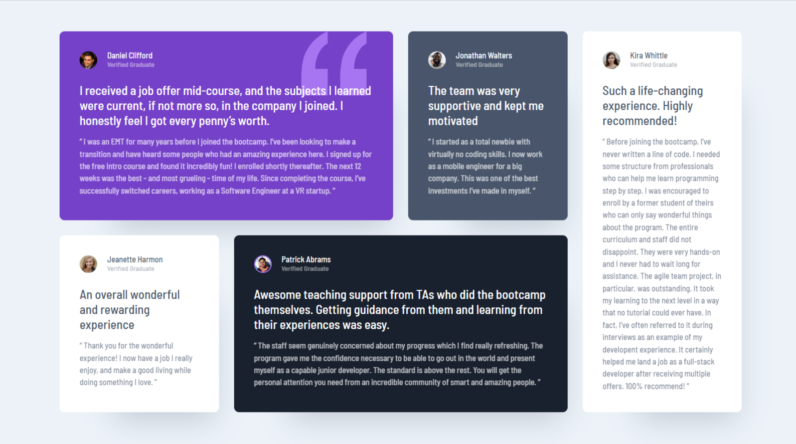

# Frontend Mentor - Testimonials grid section solution

This is a solution to the [Testimonials grid section challenge on Frontend Mentor](https://www.frontendmentor.io/challenges/testimonials-grid-section-Nnw6J7Un7). Frontend Mentor challenges help you improve your coding skills by building realistic projects. 

## Table of contents

- [Overview](#overview)
  - [The challenge](#the-challenge)
  - [Screenshot](#screenshot)
  - [Links](#links)
- [My process](#my-process)
  - [Built with](#built-with)
  - [What I learned](#what-i-learned)
- [Author](#author)

**Note: Delete this note and update the table of contents based on what sections you keep.**

## Overview

### The challenge

Users should be able to:

- View the optimal layout for the site depending on their device's screen size

### Screenshot




### Links

- Solution URL: [Code Link](https://github.com/AskatAsh/Html-CSS/tree/main/Grid-Layout)
- Live Site URL: [Live Site](https://responsive-testimonial.netlify.app/)

## My process

### Built with

- Semantic HTML5 markup
- CSS custom properties
- Flexbox
- CSS Grid
- Mobile-first workflow

### What I learned

From doing this project I learned how to work with css grid layout and some of its features like grid-template-columns, grid-column, grid-row-start, grid-column-start, grid-template-areas and more.

To see how you can add code snippets, see below:

First I declared grid to parent div and added grid areas for mobile view and added a gap between child elements.
```css
/*  */
.testimonial-grid {
  display: grid;
  grid-template-areas: 
  'one'
  'two'
  'three'
  'four'
  'five';
  gap: 1.5rem;
}
```

Next I declared grid-area to child elements of grid parent element.
```css
  .testimonial:nth-child(1){
  grid-area: one;
}
.testimonial:nth-child(2){
  grid-area: two;
}
.testimonial:nth-child(3){
  grid-area: three;
}
.testimonial:nth-child(4){
  grid-area: four;
}
.testimonial:nth-child(5){
  grid-area: five;
}
```
Finally, I customized grid-template-areas for tablet and large devices using media query.
```css
/* Responsive code */
@media screen and (min-width: 768px) {
  .testimonial-grid {
    grid-template-areas: 
    'one one'
    'two five'
    'three five'
    'four four';
  }
}
@media screen and (min-width: 996px) {
  .testimonial-grid {
    grid-template-areas: 
    'one one two five'
    'three four four five';
  }
}
```


## Author

- GitHub - [AshkatAsh](https://github.com/AskatAsh)
- Frontend Mentor - [@AskatAsh](https://www.frontendmentor.io/profile/AskatAsh)
- Twitter - [M.A. Askat](https://www.linkedin.com/in/md-abdul-ashkat/)

